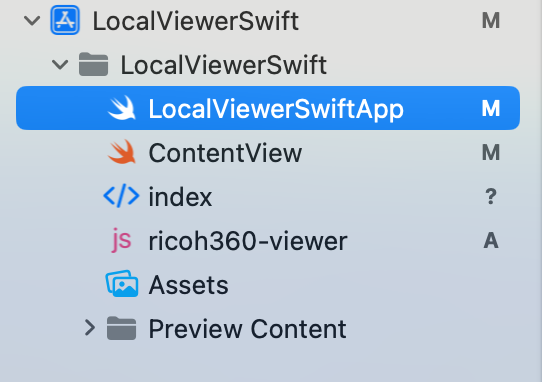

# Code Examples

Reference: [RICOH Viewer Local Sample Code Guide](https://www.notion.so/ricoh360/2024-08-28-Swift-06dff572af57443b859a4d760c267195) (in Japanese)

## Overview

- Use WebView to display local images in the viewer
- Package HTML for display and the JS provided by the platform into the app
- If you load the above html, JS, and local image in the same folder into the viewer, you can view the local image.

## local viewer code



## ricoh360-viewer.js

JS included with the platform, download and install: https://r360pf-prod-static.s3.us-west-2.amazonaws.com/viewer/v0.14.0/ricoh360-viewer.js

## index.html

```html
<!DOCTYPE html>
<html lang="en">
  <head>
    <meta name="viewport" content="width=device-width, user-scalable=no" />
    <title>PF Viewer DEMO</title>
  </head>
  <body>
    <div
      style="
             position: relative;
             width: 100%;
             height: 400px;
             background-color: #2a303c;
            "
            >
            <div id="viewer" style="width:300px; height:150px;"></div>
            <div id="message" style="width:300px; height:150px;"></div>
    </div>
    <!--  Load the viewer's javascript provided by RICOH360 API Cloud  -->
    <script src="./ricoh360-viewer.js"></script>
    <script>
      // Flag to determine whether an image is being read for the first time or for the second or subsequent times
      started = false;
      
      // A function that returns a token used for authentication when retrieving images on the platform.
      // This sample shows a local image, so no token is required, but the function itself is required for initialization, so a function that returns an empty string is defined.
      const onFetchToken = async()=>{
        return ""
      };
      
      // Initializing the viewer
      // At this point, a viewer is generated with the display position and a black background area is shown.
      viewer = new RICOH360Viewer({
        divId: 'viewer',
        onFetchToken,
      });
      
      // Use the start function to load the image for the first time, and then use the switchScene function to display the image in the viewer.
      const show = (filePath) => {
        if(started){
          viewer.switchScene({filePath});
        }else{
          viewer.start({filePath});
          started = true;
        }
      }
    </script>
  </body>
</html>
```

## LocalViewerSwiftApp.swift

```swift
import SwiftUI

@main
struct LocalViewerSwiftApp: App {
//    @UIApplicationDelegateAdaptor(AppDelegate.self) var appDelegate
    var body: some Scene {
        WindowGroup {
            ContentView()
        }
    }
}
```

## ContentView.swift

```swift
import SwiftUI
import WebKit
import PhotosUI
import CryptoKit

// This sample uses PhotosPicker to select the image to display,
// This will only work with iOS 16.0 or later
@available(iOS 16.0, *)
struct ContentView: View {
  @State private var selectedItem: PhotosPickerItem? = nil
  @State private var selectedImageData: Data? = nil
  @State private var webViewContainer = WebViewConainer()
  
  // Using WKWebView with UIViewRepresentable protocol
  struct WebViewConainer: UIViewRepresentable {
    
    let webView: WKWebView
    
    init() {
      webView = WKWebView(frame: .zero)
    }
    
    func makeUIView(context: Context) -> WKWebView {
      // Set "allowFileAccessFromFileURLs" to true to display images in the folder
      webView.configuration.preferences.setValue(true, forKey: "allowFileAccessFromFileURLs")
      return webView
    }
    
    func updateUIView(_ uiView: WKWebView, context: Context) {
      
      // Copy index.html and ricoh360-viewer.js to the Document Directory
      // Get the location path
      let jsDestPath = getFileURL(filename : "ricoh360-viewer.js")
      let htmlDestPath = getFileURL(filename : "index.html")
      let fileManager = FileManager.default
      let docDir = fileManager.urls(for: .documentDirectory, in: .userDomainMask).first!
      
      // Get the file paths included in the build
      let jsSourcePath = Bundle.main.path(forResource: "ricoh360-viewer", ofType: "js")
      let htmlSourcePath = Bundle.main.path(forResource: "index", ofType: "html")
      
      
      // Write the file (if a file with the same name already exists, delete it)
      do{
        if fileManager.fileExists(atPath: jsDestPath.path) {
          try FileManager.default.removeItem(at: jsDestPath)
        }
        if fileManager.fileExists(atPath: htmlDestPath.path) {
          try FileManager.default.removeItem(at: htmlDestPath)
        }
        
        try fileManager.copyItem(at: URL(fileURLWithPath: jsSourcePath!), to: jsDestPath)
        try fileManager.copyItem(at: URL(fileURLWithPath: htmlSourcePath!), to: htmlDestPath)
        
      }catch{
        print(error.localizedDescription)
      }
      
      // Check if file already exists
      if !fileManager.fileExists(atPath: jsDestPath.path) || !fileManager.fileExists(atPath: htmlDestPath.path) {
        print("file copy failed")
      }
      
      // Import HTML
      webView.loadFileURL(htmlDestPath, allowingReadAccessTo: docDir)
      
    }
    
    // A function to execute JavaScript in WebView from Swift side
    func executeJavaScript(_ javascript: String) {
      webView.evaluateJavaScript(javascript) { result, error in
        if let error = error {
          print("Error executing JavaScript: \(error)")
        }
      }
    }
    
  }

  var body: some View {
    VStack{
      webViewContainer
      PhotosPicker(
        selection: $selectedItem,
        matching: .images,
        photoLibrary: .shared()) {
          Text("Select a photo")
        }
        .onChange(of: selectedItem) { newItem in
          Task {
            // Get the data of the selected image
            if let data = try? await newItem?.loadTransferable(type: Data.self) {
              
              selectedImageData = data
              
              // If a file has already been selected, the file name will be the image hash value so that it can be overwritten.
              let fileName = sha256HashToString(data: selectedImageData!)
              
              // Copy the selected image to the Document Directory in the app.
              let fileURL = getFileURL(filename: fileName)
              do {
                try selectedImageData?.write(to: fileURL)
              }catch{
                print("Failed to copy image");
              }
              
              // Passing filePath when executing JavaScript in WebView
              webViewContainer.executeJavaScript("""
                show('\(fileURL.lastPathComponent)');
              """)
            }
          }
        }
    }
  }
}

#Preview {
  ContentView()
}

// Get the save destination of the Document Directory in the app
func getFileURL(filename: String? = nil) -> URL {
  let docDir = FileManager.default.urls(for: .documentDirectory, in: .userDomainMask).first!
  return docDir.appendingPathComponent(filename ?? UUID().uuidString + ".jpg")
}

// Get hash value from file data
func sha256HashToString(data: Data) -> String {
    let hash = SHA256.hash(data: data)
    return hash.compactMap { String(format: "%02x", $0) }.joined()
}
```

## Check Operation on Actual Device

{width=50%}
