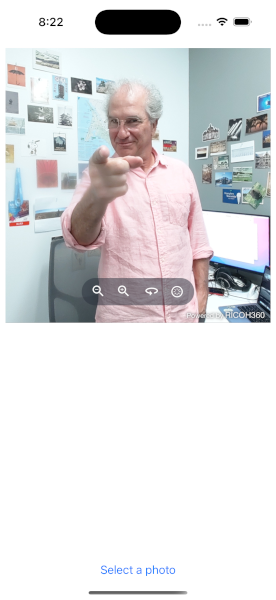
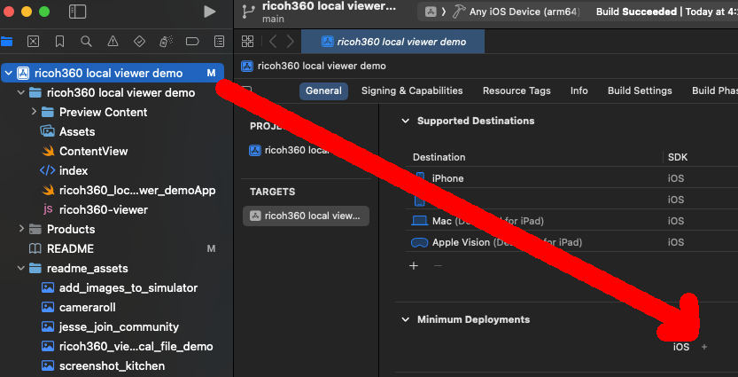
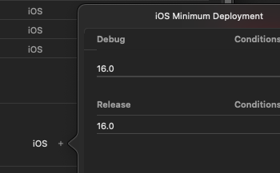
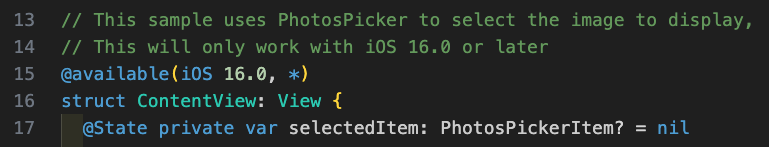
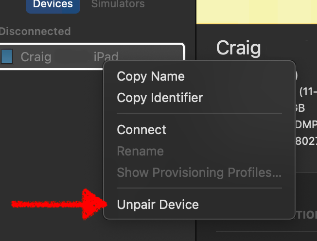
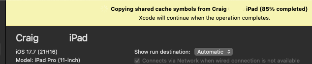

# Help and Troubleshooting

Please post questions to the .guide developer community.

<https://community.theta360.guide/>

Jesse Casman wants you in the theta360.guide community.  🌇

## Build failing due to unsupported iOS version

You can bring the minimum deployment target down to iOS 16.

Example of setting minimum deployment to iOS 16.

Unless you modify the code, you cannot set the iOS target to 15 or lower due to the use of PhotosPicker in ContentView.swift.

## physical device not synced with Xcode

in Xcode menu Window -> Devices and Simulators, right-click and then select Unpair devices.

Unplug physical device, plug it back in. It will take several minutes to sync.

