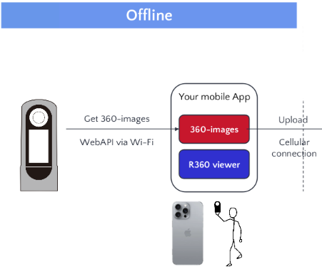
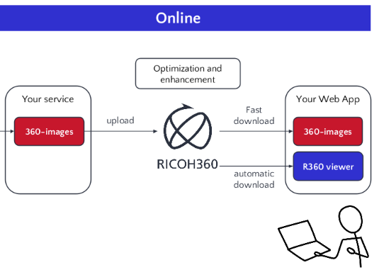
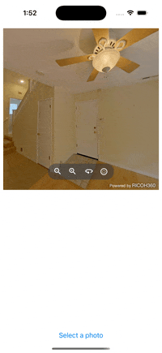
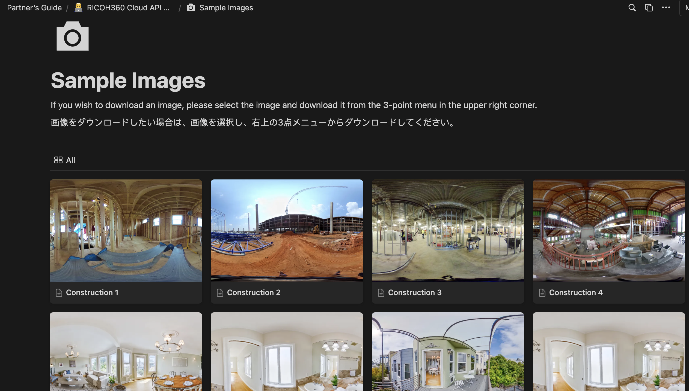
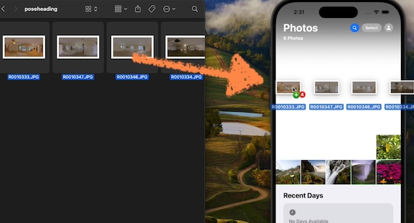
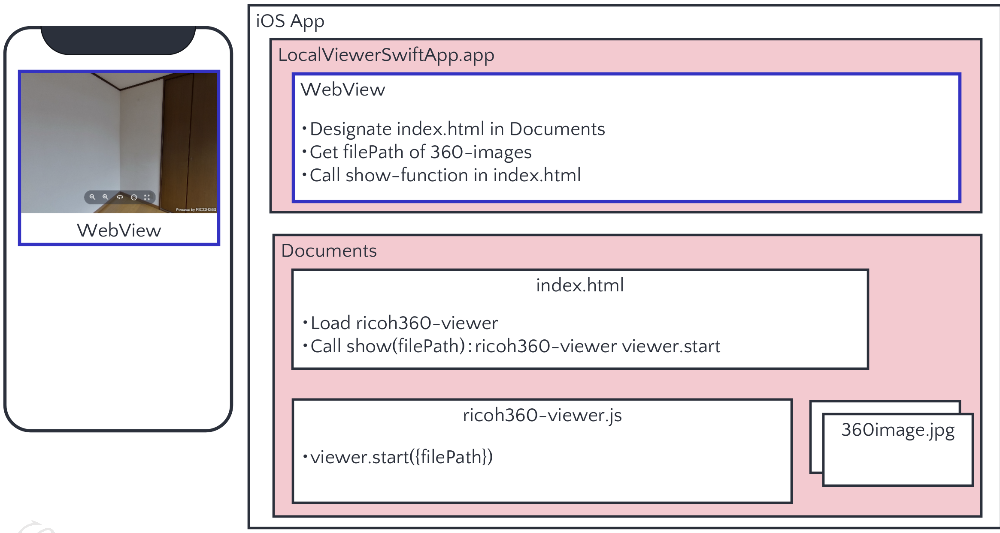
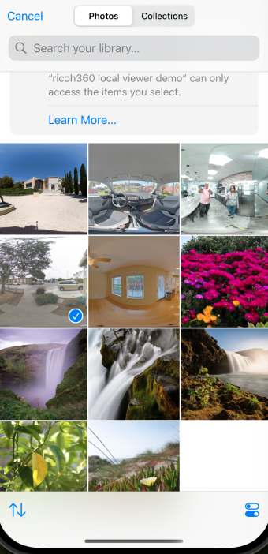
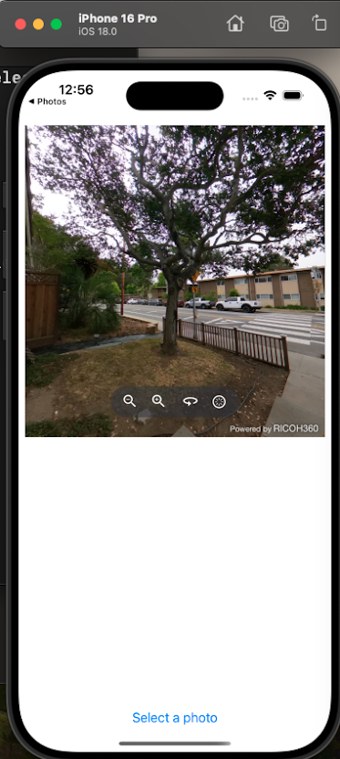
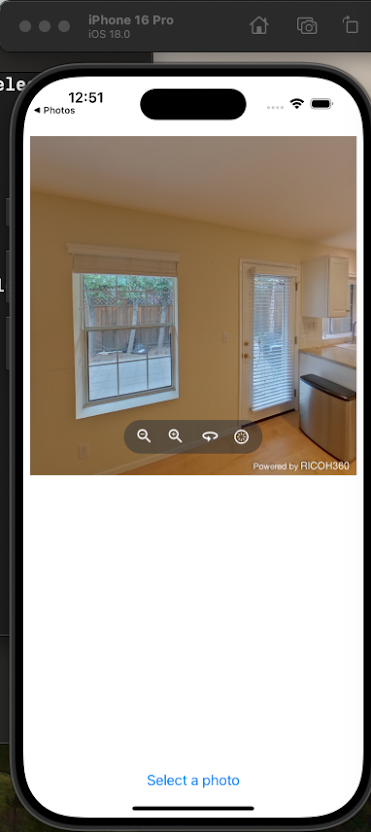

# Using RICOH360 Viewer On-site with no Internet

RICOH360 provides a seamless way to share 360-degree images from remote locations
and excels at scalable image management when online.

The viewer can be automatically downloaded from the RICOH360 Cloud to appear
magically in your local app.  Or, the viewer can be built into your mobile
app with an iOS Podfile.  Using WebView, the RICOH360 Viewer can work in both
offline and online mobile applications.

## Video Demonstration

[RICOH360 Viewer With Local Images When Offline](https://youtu.be/0sTO38q53Ro)

## Preparation to Display Local Files

* `ricoh360-viewer.js`: RICOH360 viewer library for 360-degree images
* `index.html`: Your web page to display 360-degree images using a WebView
* 360 images stored locally

!!! tip Sample Images available

    RICOH provides [sample images](https://ricoh360.notion.site/Sample-Images-a143557948c74309bc6ec7bd2159830e) that can be used by developers for
    testing. A password is required.  Please contact RICOH for a
    partner password.

### Transferring files into iOS simulator

Drag and drop files into simulator.

## Viewer Versions

Viewer versions are listed [here](https://ricoh360.notion.site/Release-Notes-a3f8cdc266de4bd38411f5a032d5b673)

As of October 17, 2024, the most recent viewer version is v0.15.0.

## Offline Viewer Setup Steps

1. Copy local files to the Document Directory (Documents) in your application
1. Load `index.html` in the `WebView` of your application
1. Retrieve file paths of local 360-degree images from the Documents directory
1. Execute functions in `index.html` to display 360-degree images in the WebView

## Offline Viewer Setup Overview

The viewer setup for offline mobile apps  differs from online use.
For offline use, the Private Key is not required.  If you are
switching between online and offline use, you will need a Private Key
from RICOH.

The transforms should be done when the viewer is online.

In the diagram above, the developer should create the `show()` function themselves
and have it execute either `viewer.start({filePath})` or `viewer.switchScene({filePath})`.

During your evaluation, make sure you are referring to the correct
technical documentation.  The API and features for offline and online mode are different.
We recommend that you evaluate offline mode in parallel to online mode.

## Using Viewer Offline

After saving RICOH THETA images to the camera roll, select an image
for the viewer. 

!!! warning
    11K images did not work in the simulator in our test. The images work
    fine in a physical device. For simulator testing, you may need to use
    the 5.5K images from the X or the 6.7K JPEG image from the Z1.

You will be able to switch the image by going back to the camera
roll and selecting another image.  You do not have to connect to
the Internet.  You will be able to select many different images
without having to connect to a network.

## Online Viewer

There is an excellent [document to use the RICOH360 Viewer online](https://ricoh360.notion.site/Integrate-RICOH360-Viewer-into-your-own-iOS-application-ed538328fd4f449ca9c0081792854d71)
in your iOS application.

The document refers to a backend server. An [example backend server](https://github.com/theta360developers/oppkey-ricoh-viewer-demo-basic) and web application is
available in the community.

!!! tip
    The online viewer is often used with the RICOH360 Cloud service to manage content.
    The RICOH360 Cloud API requires a Secret Key that is different from the Private
    Key used with the RICOH360 Viewer.

!!! info
    A maven package is available for Android, but the documentation is still
    in progress.
