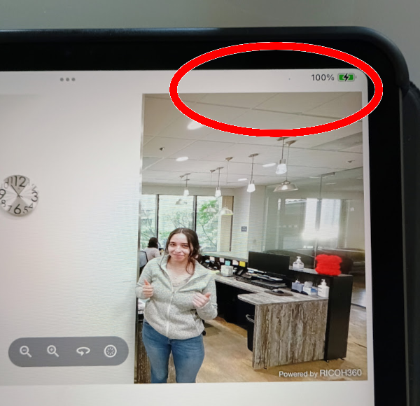
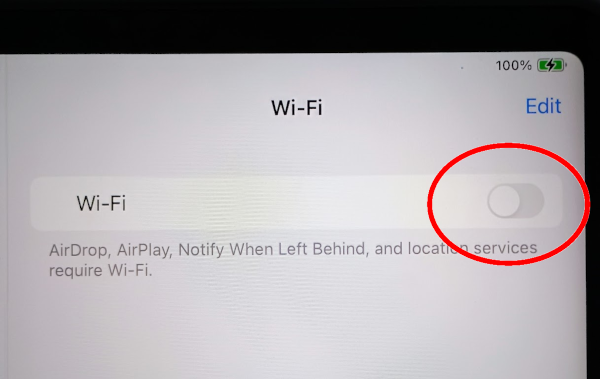
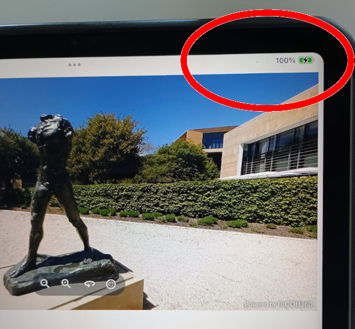
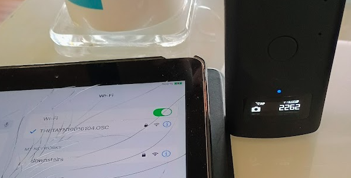
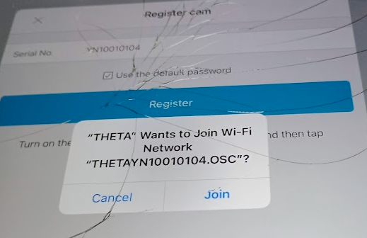
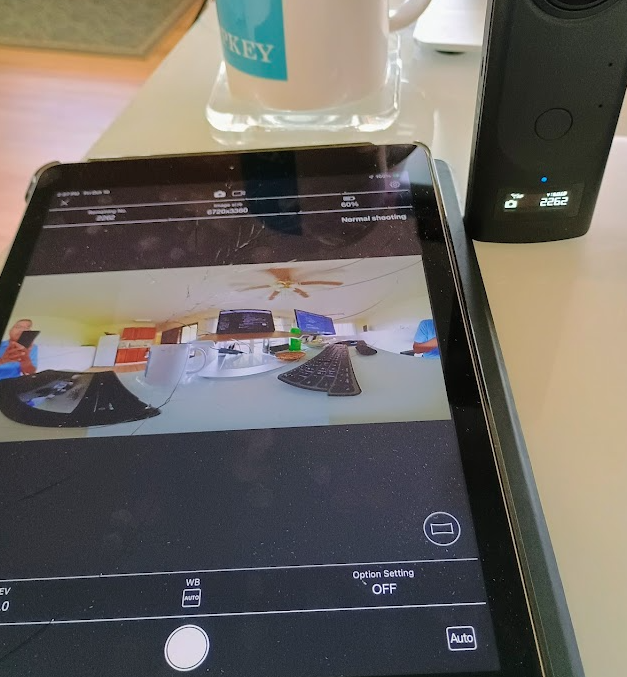
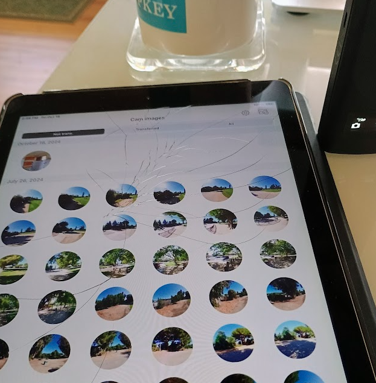

# Testing Demo with Physical Devices

11K image, no WiFi. Works as expected. Using iOS 17.

On the physical device, the WiFi and mobile data are turned off. There is no mobile (like 5G) on the iPad used in the test.

## Getting Images Onto Physical Device

You can get images onto the physical device with something like Air Drop.

Or, you can use the official RICOH THETA mobile app to replicate the
picture taking capability and then use this demo app to test the
RICOH360 Viewer.

### Testing with THETA mobile app on iOS

Get the app

<https://support.theta360.com/en/download/>

Connect iPad or iPhone to the RICOH THETA camera.
The camera is the hotspot and should be in Access Point mode.

The password is just the numerical digits of the camera serial number.

You can also connect the camera through the app.

Use the mobile app to take a picture.

Use the official mobile app to transfer the images from the RICOH THETA Z1 or X
to the local camera roll.

